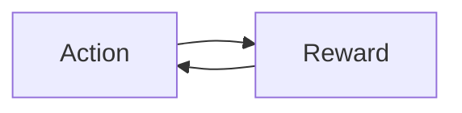
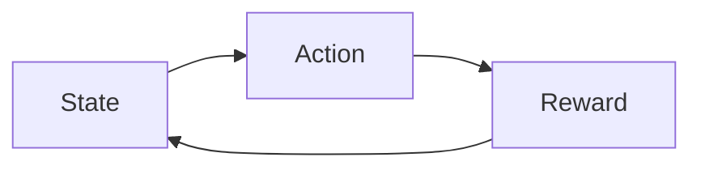

> 介紹 Multi-Arm Bandits 問題與基本的兩大流派概念

<!-- more -->

# Problems Definition

這邊的 Bandits 指的是吃角子老虎機, 是一種會機率性返回報酬的機器, 你可以很直覺的想到基本題目與傳統的擲硬幣一樣, 是個計算期望值的問題

**最基本的問題假設: Single Bandit, 最大期望值為?**

## MAB (Multi-Armed Bandits)

當問題進一步變成多台機器, 並且每一臺機器的期望值都不同, 我們該如何獲取更高的報酬?

- Exploitation (嘗試): 選擇一個不確定性低且期望值高的機器進行嘗試
- Exploration (探索): 選擇不確定性高的機器進行探索, 希望獲取潛在更高的期望值

MAB 問題通常被視為是 Bernoulli Bandits, 也就是只有獲得報酬與沒有獲得報酬兩種可能性, 定義為 $(A, R)$ 

- $A$ 代表可執行的動作集合 (action set)
- $R$ 代表可獲得的報酬集合 (reward set)
- $Q(a) = E[r|a] = \theta$ 代表執行動作後的預期報酬
- $r_t = R(a_t)$ 代表執行動作後的實際報酬

我們可以認為 $Q(a)$ 是 Bernoulli Distribution 中的成功機率
當我們在做第 $t$ 次決策時會先「選擇一個執行動作」再「獲取報酬」

- $Q(a)$ = true mean
- $\tilde{Q}(a)$ = sample mean

## Contextual Bandits

假設現在我們希望透過 Bandits 演算法解決現實世界的推薦系統問題

- Bandits 代表要被推薦的商品
- Action 代表我們是否要推薦
- Reward 代表用戶是否有購買我們推薦的商品

前面我們提到的 MAB 決策流程比較像是下面這張圖,
但是這種決策流程會假設所有用戶對於商品的偏好都是一樣的, 而這也很明顯示不符合實際狀況的

事實上我們應該在決策流程中加入用戶偏好, 也就是在決策過程中加入外部資訊 (context)

這邊根據是否有外部資訊的協助判斷進一步分為

- Contextual Free Bandits
- Contextual Bandits

## Online Contextual Bandits

延續上面的討論, 假設我們要將 Contextual Bandits 實際應用於產品端,
勢必會變為一個開放性問題, 因為商品數量與用戶數量都是動態的, 
並且如同所有的 Modeling 目標就會開始分為

- 如何在最短時間內收斂到足夠好的結果
- 如何產生最高收益

而目前主流包含兩種框架的解法

- UCB (Upper Confidence Bound)
- TS (Thompson Sampling)

# MAB (Bernoulli Bandits) Solution

在前面 MAB 的部份也有提到一開始會假設他是 Bernoulli Bandits, 也就是只有獲取報酬成功或失敗兩中選擇,
以下針對主要的兩種框架做討論

## UCB (Upper Confidence Bound)

前面我們提到在 MAB 的決策中, 主要會根據 bandit 的不確定性以及期望值來做決策,
對於這種未知估計, 在統計學中可以透過信賴區間 (Confidence Interval, CI) 來量化期望值

UCB 的基本概念就是將信賴區間的上界 (Upper Bound) 視為預期報酬做決策,
選擇 UCB 最高的 bandit 進行嘗試或探索, 預期獲取最高潛在報酬

- 未知或是嘗試次數少的 bandit
 - 均值低, 不確定性高 -> UCB 高 -> 高機率被探索
    - 均值高, 不確定性高 -> UCB 更高 -> 更高機率被探索
- 嘗試次數高的 bandit
 - 均值低, 不確定性低 -> UCB 低 -> 繼續嘗試的機率低
    - 均值高, 不確定性低 -> UCB 高 -> 繼續嘗試的機率高

UCB 預期報酬的算法為

$$
Q_{n}(a)+\sqrt{\frac{2\log(n)}{n_{i}}}
$$

- $Q_n(a)$ 代表目前決策的預期報酬
- $n$ 代表總決策次數
- $n_{i}$ 代表對 bandit $i$ 的總嘗試次數

其中平方根底下的數字代表每次決策 $a$ 的預估變異數 (variance),
假設我們還沒選過 bandit $i$

- $n_{i} = 0$ -> 變異數接近無限大 -> UCB 接近無限大
- bandit $i$ 會是下一次決策的選擇 

其中由於 $log(n)$ 的特性, 針對 bandit $i$ 如果我們選擇越來越多次

- 影響力取 log -> 對於下一次決策是否要選擇 bandit 的判斷影響越來越小

## TS (Thompson Sampling)

基本上目的與 UCB 相同, 都是為了要量化 MAB 在決策過程中考慮期望值,
只是 UCB 是透過區間估計的方式, 而 TS 是透過 probability matching 的方式

同樣以 Bernoulli Bandit 為討論, 我們可以假設報酬的機率分佈是 beta distribution $Beta(\alpha, \beta)$

- $\alpha$ 代表獲取報酬成功的次數
- $\beta$ 代表獲取報酬失敗的次數

決策過程中包含兩個很重要的步驟

1. 如何決定每一個 bandit 在這次決策中的預期報酬
2. 獲取報酬後如何更新 bandit 的資訊, 讓下次可以更準確的預估報酬

在 TS 中, 因為每個 bandit $i$ 都會有獨立的 $Beta(\alpha_{i}, \beta_{i})$

- 在 (1) 中會從各自的機率分佈中 sample 出期望值
- 在 (2) 中會根據獲取報酬的成功或失敗更新 bandit 的 $\alpha_{i}$ 與 $\beta_{i}$

我們假設從 bandit 成功獲取報酬的機率為 $r_{i} = \theta_{i}$

- $p(r | \theta_{i})$ ~ $Beta(\theta_{i})$, 獲得報酬的機率遵循 Bernoulli 分佈
- 透過 Bayesian Inference 針對被選中的 bandit 更新 $p(\theta_{i})$
 - 考慮到 beta distribution conjugacy (共軛性質), 所以只要更新被選中的 bandit
    - $(\alpha_{i}, \beta_{i}) \leftarrow (\alpha_{i}, \beta_{i}) + (r_{i}, 1 - r_{i})$

## 延伸閱讀 - Contextual Bandits

前面也有提過, 如果要將 MAB 拿來解決現實問題, 會因為假設所有人對於 bandit 的偏好是相同的而導致實際上效果不佳

延伸 UCB 與 TS 的 Contextual Bandits 算法可先從 LinUCB 跟 LinTS 了解, 
想要了解的有在 reference 附上論文原文連結

針對 Contextual Bandits 的問題, 主要會落在如何把特徵向量納入考慮, 
這邊會變成將重點放在「如何表示歷史報酬」

- UCB <> LinUCB
	- UCB 以信賴區間表示歷史報酬的表現
	- LinUCB 不特別定義一個機率分佈, 而是以一組線性關係取代 $x^T\theta$
- TS <> LinTS
	- TS 以 beta 分佈表示歷史報酬的表現
	- LinTS 為了同樣以 beta 表現, 要讓 prior 跟 posterior 符合共軛分佈才能在訓練過程更新參數

雖然過程跟細節包含大量數學推導 (筆者自己也還沒能看完), 
但是簡而言之, 就是要將獲取報酬的成功與否與特徵向量之間的關係作為機率分佈表示, 
上面舉例表示為線性關係, 所以其實就是 Linear Regression (LinUCB, LinTS), 
相信以這種方式理解後再去看其他 contextual bandits 的方式會比較快上手

# Summary UCB <> TS

回顧兩者都是針對量化預期報酬所設計出來的算法

- UCB: 根據信賴區間
- TS: 根據各自 beta distribution sample 的結果

但是雙方對於報酬的機率分佈確有不同的看法, 
假設我們定義每次會有  的機率取得報酬,  的機率失敗

- 頻率學派 -> UCB
	- $\theta$ 是一個固定的值
	- 透過嘗試推測 $\theta$ 的值, $rewards / n$
	- 隨著嘗試次數越來越多, $\theta$ 會趨近真實的機率
	- **嘗試的結果是固定的, 在模型更新之前, 推薦結果不會改變**
- 貝氏學派 -> TS
	- $\theta$ 是一個固定的值
	- 透過機率分佈描述 $\theta$ 的不確定性
	- 隨著嘗試次數越來越多, 描述 $\theta$ 的不確定性會越來越小 (在 $\theta$ 的機率密度越來越高)
	- **嘗試的結果是不固定的, 在模型更新之前, 推薦結果會服從同樣的機率分佈**

# Reference

- post
	- [EE 问题概述](http://wulc.me/2019/01/05/EE(Exploitation%20Exploration)%20%E9%97%AE%E9%A2%98%E6%A6%82%E8%BF%B0/)
	- [統計學:大家都喜歡問的系列-要抽多少樣本才夠做統計](https://chih-sheng-huang821.medium.com/%E7%B5%B1%E8%A8%88%E5%AD%B8-%E5%A4%A7%E5%AE%B6%E9%83%BD%E5%96%9C%E6%AD%A1%E5%95%8F%E7%9A%84%E7%B3%BB%E5%88%97-%E8%A6%81%E6%8A%BD%E5%A4%9A%E5%B0%91%E6%A8%A3%E6%9C%AC%E6%89%8D%E5%A4%A0%E5%81%9A%E7%B5%B1%E8%A8%88-848847b3492a)
	- [Multi-Armed Bandits: UCB Algorithm](https://towardsdatascience.com/multi-armed-bandits-ucb-algorithm-fa7861417d8c)
	- [The Multi-Armed Bandit Problem and Its Solutions](https://lilianweng.github.io/lil-log/2018/01/23/the-multi-armed-bandit-problem-and-its-solutions.html)
	- [Multi-Armed Bandit: Thompson Sampling](https://zhuanlan.zhihu.com/p/32410420)
	- [機器學習A-Z～Thompson抽樣演算法](https://www.mdeditor.tw/pl/21ld/zh-tw)
	- [\[貝氏統計\] — 為什麼選擇Beta分佈做為先驗?](https://yulongtsai.medium.com/why-choose-beta-distribution-as-prior-9f0d5f7d0e3)
- paper
	- [Exploring compact reinforcement-learning representations with linear regression](https://arxiv.org/ftp/arxiv/papers/1205/1205.2606.pdf)
	- [Thompson Sampling for Contextual Bandits with Linear Payoffs](https://arxiv.org/pdf/1209.3352.pdf)
